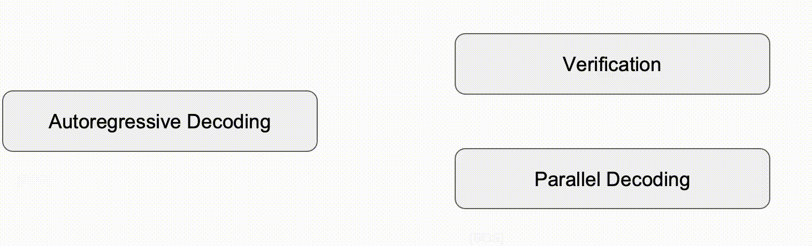

# Generalized Aggressive Decoding

## Introduction

This repository contains all the code and checkpoints used to reimplement our paper: [Lossless Speedup of Autoregressive Translation with Generalized Aggressive Decoding](https://arxiv.org/pdf/2203.16487.pdf).



## News

- 2022.09.20 Update💥:  the memory cost of GAD is optimized. Now you can obtain **3x~5x speedup** using GAD with only **~300MiB of extra memory cost** (~240 MiB for model states), compared to Transformer's greedy decoding.
- 2022.09.21 Update💥:  the inference codes for the summarization task are released.

## Download model

| Description | Model                                                        |
| ----------- | ------------------------------------------------------------ |
| wmt14.en-de | [at-verifier-base](https://drive.google.com/file/d/1L9z0Y5rked_tYn7Fllh-0VsRdgBHN1Mp/view?usp=sharing)， [nat-drafter-base (k=25)](https://drive.google.com/file/d/1fPYt1QGgIrNfk78XvGnrx_TeDRYePr2e/view?usp=sharing) |
| wmt14.de-en | [at-verifier-base](https://drive.google.com/file/d/1h5EdTEt2PMqvAqCq2G5bRhCeWk8LzwoG/view?usp=sharing)， [nat-drafter-base (k=25)](https://drive.google.com/file/d/1IEX2K65rgv5SUHWxiowXYaS--Zqr3GvT/view?usp=sharing) |
| wmt16.en-ro | [at-verifier-base](https://drive.google.com/file/d/1WocmZ9iw_OokYZY_BtzNAjGsgRXB-Aft/view?usp=sharing)， [nat-drafter-base (k=25)](https://drive.google.com/file/d/1V_WbPRbgmIy-4oZDkws9mdFSw8n8KOGm/view?usp=sharing) |
| wmt16.ro-en | [at-verifier-base](https://drive.google.com/file/d/1LWHC56HvTtvs58EMwoYMT6jKByuMW1dB/view?usp=sharing)， [nat-drafter-base (k=25)](https://drive.google.com/file/d/1P21nU3u4WdJueEl4nqAY-cwUKAvzPu8A/view?usp=sharing) |

## Requirements

- Python >= 3.7
- Pytorch >= 1.5.0

## Installation

```
conda create -n gad python=3.7
cd GAD
pip install --editable .
```

## Preprocess

The datasets we used can be obtained following the script released by [Mask-Predict](https://github.com/facebookresearch/Mask-Predict/blob/main/get_data.sh). We release the bpe codes and our dicts in `./data`.  The tokenized datasets are preprocessed as follows:

```
text=PATH_TO_YOUR_DATA
src=source_language
tgt=target_language
bin_path=PATH_TO_BIN_DIR

model_path=PATH_TO_MODEL_DICT_DIR

fairseq-preprocess --source-lang ${src} --target-lang ${tgt} \
    --trainpref $text/train --validpref $text/valid --testpref $text/test \
    --destdir ${bin_path} --workers 60 \
    --srcdict ${model_path}/dict.${src}.txt \
    --tgtdict ${model_path}/dict.${tgt}.txt
```

## Encoder Initialization

We recommend using the AT verifier's encoder to initialize the weights of the NAT drafter. For preparing the initialization checkpoints, check `encoder_initial.py`.

## Train

**The AT verifier** of GAD is a standard Transformer that can be trained with [fairseq](https://github.com/facebookresearch/fairseq/tree/main/examples/translation):

```
fairseq-train ${bin_path} --arch transformer --share-all-embeddings \
      --task translation --source-lang ${src} --target-lang ${tgt} \
      --criterion label_smoothed_cross_entropy --dropout ${dropout} \
      --label-smoothing 0.1 --lr ${lr} --clip-norm 3.0 \
      --warmup-init-lr 1e-7 --min-lr 1e-9 --lr-scheduler inverse_sqrt \
      --weight-decay 0.00001 --update-freq ${update_freq} --fp16 --seed ${seed} \
      --warmup-updates ${warmup} --optimizer adam \
      --adam-betas '(0.9, 0.98)' --max-tokens ${max_tokens} --max-epoch ${max_epoch} \
      --save-dir ./checkpoints \
      --eval-bleu \
      --eval-bleu-args '{"beam":5}' \
      --eval-bleu-detok moses \
      --eval-bleu-remove-bpe \
      --eval-bleu-print-samples \
      --best-checkpoint-metric bleu --maximize-best-checkpoint-metric
```

For training **the NAT drafter** of GAD (check `train.sh`):

```
python train.py ${bin_path} --arch block --noise block_mask --share-all-embeddings \
    --criterion glat_loss --label-smoothing 0.1 --lr ${lr} --warmup-init-lr 1e-7 \
    --stop-min-lr 1e-9 --lr-scheduler inverse_sqrt --warmup-updates ${warmup} \
    --optimizer adam --adam-betas '(0.9, 0.999)' --adam-eps 1e-6 \
    --task translation_lev_modified --max-tokens ${max_tokens} --weight-decay 0.01 \
    --dropout ${dropout} --encoder-layers 6 --encoder-embed-dim 512 --decoder-layers 6 \
    --decoder-embed-dim 512 --fp16 --max-source-positions 1000 \
    --max-target-positions 1000 --max-update ${update} --seed ${seed} --clip-norm 5 \
    --save-dir ./checkpoints --src-embedding-copy --log-interval 1000 \
    --user-dir block_plugins --block-size ${size} --total-up ${update} \
    --update-freq ${update_freq} --decoder-learned-pos --encoder-learned-pos \
    --apply-bert-init --activation-fn gelu \
    --restore-file ./checkpoints/initial_checkpoint.pt \
    --reset-optimizer --reset-meters --reset-lr-scheduler --reset-dataloader
```

## Hyperparameters

The hyperparameters of the NAT drafter are shown as follows:

| Hyperparameters \ Datasets | WMT14 EN-DE | WMT16 EN-RO |
| -------------------------- | :---------: | :---------: |
| learning rate              |   0.0005    |    0.001    |
| dropout                    |     0.1     |     0.2     |
| warm up                    |    10000    |    4000     |
| max update                 |    300K     |     50K     |
| batch size (tokens)        |    128K     |     64K     |

> the effective batch size of tokens is calculated by GPU_NUM * MAX_TOKENS * UPDATE_FREQ.

## Inference

For GAD++   (check `inference.sh`, set `beta=1` for vanilla GAD):

```
python inference.py ${data_dir} --path ${checkpoint_path} --user-dir block_plugins \
    --task translation_lev_modified --remove-bpe --max-sentences 20 \
    --source-lang ${src} --target-lang ${tgt} --iter-decode-max-iter 0 \
    --iter-decode-eos-penalty 0 --iter-decode-with-beam 1 --gen-subset test \
    --AR-path ${AR_checkpoint_path} --input-path ${input_path} \
    --output-path ${output_path} --block-size ${block_size} --beta ${beta} --tau ${tau} \
    --batch ${batch} --beam ${beam} --strategy ${strategy}
```

> We test the inference latency of GAD with batch 1 implementation, check `inference_paper.py` for details.
>
> check `inference_drafter.py` for inference with our NAT drafter only.

Calculating compound split bleu:

```
./ref.sh
```

## Example

We put the first three tokenized sentences of WMT14 EN-DE in `data/wmt14.en-de/example.en`. Put this file in the `input_path` of the inference script. The results below were obtained by running  `inference.sh` with  `inference_paper.py` (on 1 Nvidia P100 GPU, Pytorch 1.10, CUDA 11).

| Model           | Accepted Tokens (average) | Latency (s) |
| --------------- | :-----------------------: | :---------: |
| Fairseq (beam5) |           1.00            |    0.83     |
| Fairseq (beam1) |           1.00            |    0.81     |
| vanilla GAD     |           3.55            |    0.44     |
| GAD++           |           6.18            |    0.27     |

You can find the translation results in `./output`.

## Extra Memory Cost

Since there is no need to save intermediate variables during inference, GAD can achieve **3x~5x decoding speedup** (by alternating NAT and AT decoding) with only **~300MiB of extra memory cost**. Below is the `nvidia-smi` memory cost comparison of AT and GAD, tested on WMT14 EN-DE:

| Model \ Batch Size | Model States (Params) |  1   |  4   |  8   |  16  |  32  |
| ------------------ | :-------------------: | :--: | :--: | :--: | :--: | :--: |
| Fairseq (beam1)    |        232.38         | 1670 | 1712 | 1758 | 1844 | 2028 |
| GAD++              |   469.75 (AT + NAT)   | 1902 | 1938 | 2012 | 2108 | 2298 |
| Extra Memory       |     237.38 (NAT)      | 232  | 226  | 254  | 264  | 270  |

## Note

This code is based on GLAT [(https://github.com/FLC777/GLAT)](https://github.com/FLC777/GLAT). 

## Citation

If you find the resources in this repository useful, please cite our paper:

```
@article{Xia2022GAD,
	title = {Lossless Speedup of Autoregressive Translation with Generalized Aggressive Decoding},
	journal = {ArXiv},
	author = {Xia, Heming and Ge, Tao and Wei, Furu and Sui, Zhifang},
	year = {2022},
	note = {arXiv: 2203.16487}
}
```

